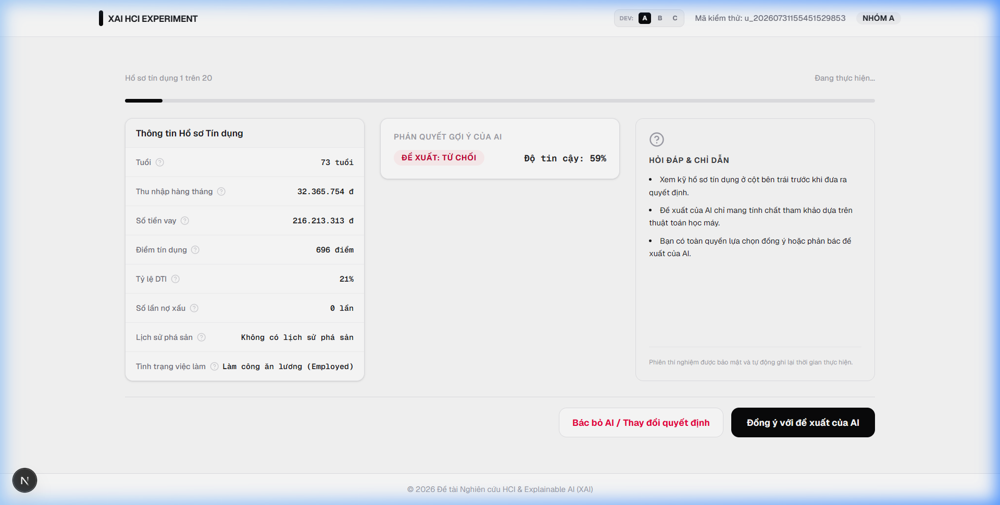

# Document 2: Web Application Architecture & Experimental User Flow

This document details the web system developed for the HCI credit underwriting experiment, including the database schema, API design, interface layout groups, and telemetry tracking capabilities.

---

## 1. Web Application Framework

The system is built as a modern, high-performance web application utilizing:
*   **Frontend**: Next.js 15, React 19, and TailwindCSS for responsive layout.
*   **Database ORM**: Prisma Client mapped to a PostgreSQL database hosted on Supabase.
*   **State Management**: React state hooks coupled with local storage persistence.
*   **API Layer**: Next.js API Routes (`/api/users`, `/api/responses`, `/api/survey`, `/api/chat`).

---

## 2. Dynamic Bilingual Support & Configuration

The application features a dynamic bilingual switcher (English/Vietnamese) located in the header bar.
*   **Mechanism**: A custom `translations.json` dictionary maps all user interface strings, buttons, descriptions, and glossary tooltips.
*   **On-the-fly Translation**: Underwriter profiles, AI chatbot interactions, and SHAP explanation texts are dynamically translated using a lookup pattern, minimizing client-side overhead and avoiding database synchronization issues.

---

## 3. UI Layout and Group Walkthroughs

The application implements three distinct interfaces tailored for each test group.

### 3.1. Group A (Black-box AI)
Displays only the client's financial profile and the AI's final recommendation (Approve/Reject) with a confidence level. No explanation charts or models are shown.

---

### 3.2. Group B (Visual XAI)
Displays the profile, AI recommendation card, and a basic **SHAP Bar Chart** illustrating the positive (emerald) and negative (rose) weights of attributes contributing to the prediction, along with a natural language summary.

---

### 3.3. Group C (Interactive & Contextual XAI)
An advanced dashboard designed to study cognitive overload. The interface changes the standard layout flow completely:
1.  **SHAP Force Plot**: Positioned prominently at the top to visualize opposing forces pushing the decision probability away from the 65% base rate.
2.  **AI Recommendation Card & Natural Language Explanation**: Located alongside the Force Plot.
3.  **Detailed Analytics Row**: Embeds the client credit profile, SHAP Bar Chart, and the **Conversational AI Explainer (Gemini Chatbot)**.
4.  **Decision Mathematics (Pearson Correlation Matrix)**: Located at the bottom to show advanced statistical indicators (ROC-AUC, Log-Loss, Standard Error).

---

## 4. Telemetry & HCI Tracking Mechanism

To capture granular human behavior before decisions are finalized, the system registers:
*   **Response Time (Decision Time)**: Tracks elapsed milliseconds from scenario mount to submission.
*   **Hover Events**: Logs the count and total duration (seconds) that a user hovers over specific financial attributes (e.g. credit score tooltip lookup).
*   **Chatbot Logs**: Records all user queries and AI responses (number of questions asked, chat history).
*   **NASA-TLX Survey**: Collects six-dimensional workload ratings upon completing all 20 scenarios.

Data is saved to the PostgreSQL database on Supabase via the Prisma schema.

---

### AI Collaboration & Attribution Statement
*   **Technical Support & Drafting**: This document was compiled, structured, and translated with the assistance of **Antigravity (Advanced Agentic Coding Assistant from Google DeepMind)**.
*   **Scientific Design & Responsibility**: The core research objectives, experimental hypotheses, empirical data collection, and qualitative UI insights (such as task workflow ambiguity observations) are the sole intellectual product and scientific responsibility of the human researcher (thesis author).

