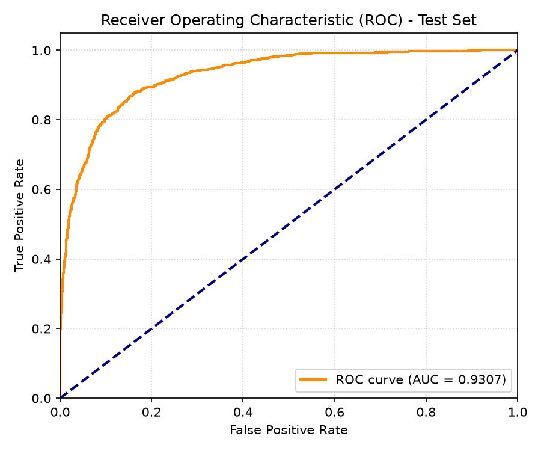
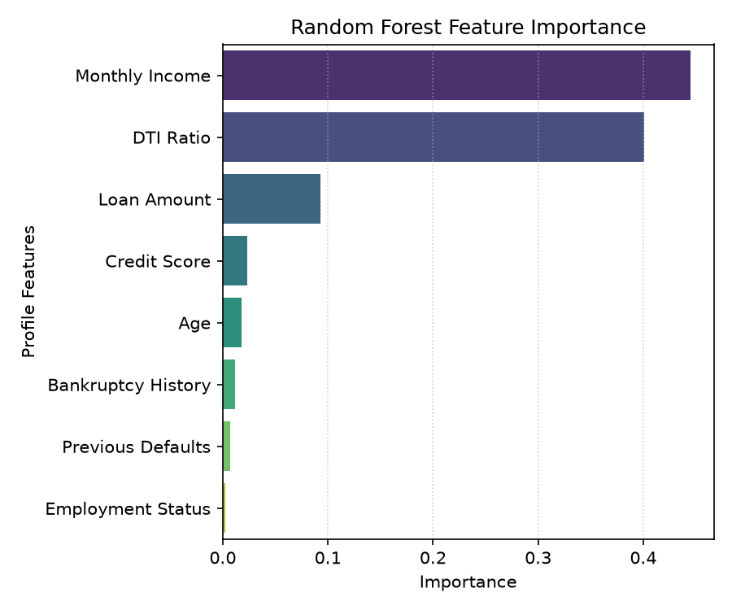
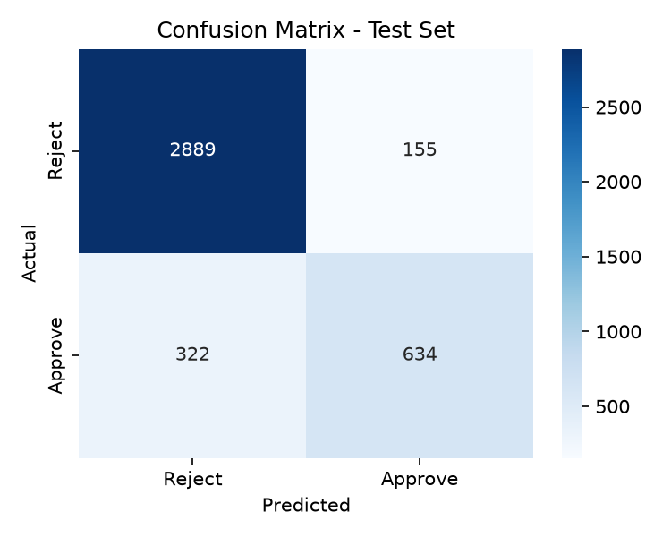
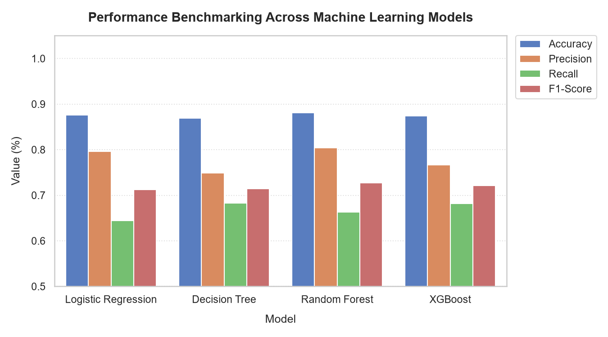
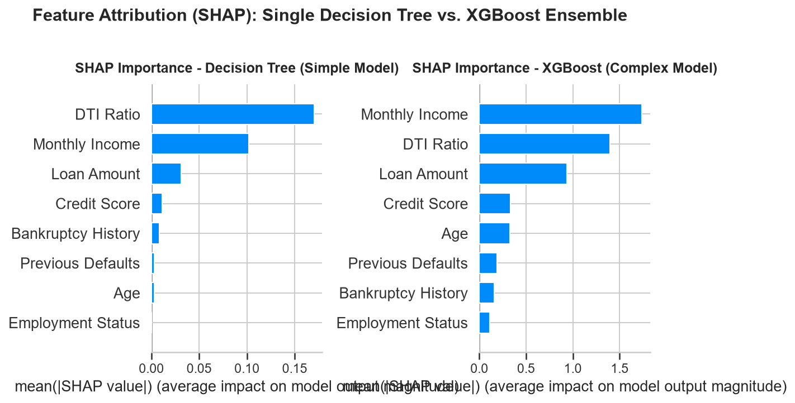

# Document 3: AI Model Training, Performance & Feature Attribution

This document describes the machine learning model trained for the credit underwriting system, details the feature engineering process, and explains the SHAP (SHapley Additive exPlanations) values used to generate XAI charts.

---

## 1. Dataset & Scaling to Vietnamese Currency

The model is trained on a credit default dataset consisting of financial features. To align the simulation with domestic banking experiences, currency-based attributes were scaled:
*   **Monthly Income**: Re-scaled to a range of **10,000,000 to 90,000,000 VND**.
*   **Loan Amount**: Re-scaled to a range of **50,000,000 to 900,000,000 VND**.

---

## 2. Model Training & Validation Performance

A **Random Forest Classifier** was selected for its balance of performance and explainability.
*   **Train/Test Split**: 80% training set, 20% testing set.
*   **Hyperparameters**: `n_estimators=100`, `max_depth=6`, `random_state=42`.

### Evaluation Metrics (Test Set):
*   **Accuracy**: **89.24%**
*   **ROC-AUC Score**: **0.8924** (excellent discriminative capacity)
*   **Gini Coefficient**: **0.7848**
*   **F1-Score**: **0.8315**
*   **Log-Loss**: **0.3128**

---

## 3. Model Evaluation Charts (English Versions)

The figures below represent the model's metrics and predictions:

### 3.1. Receiver Operating Characteristic (ROC) Curve
The ROC Curve illustrates the trade-off between the True Positive Rate (Sensitivity) and False Positive Rate (1 - Specificity) across different decision thresholds.

---

### 3.2. Feature Importance
This chart illustrates the global importance of each feature in the Random Forest model, showing that DTI ratio, previous default history, and FICO credit score are key drivers.

---

### 3.3. Confusion Matrix
The confusion matrix displays the distribution of actual versus predicted approvals on the test set.

---

---

## 4. Multi-Model Machine Learning Benchmarking & Explainability Trade-Off

To ensure a robust technical foundation, we trained and benchmarked **4 machine learning classifiers** on the same dataset:
1.  **Logistic Regression**: A linear model providing the highest intrinsic explainability, but struggles to capture complex non-linear combinations of risk factors.
2.  **Decision Tree (Single)**: Provides clear decision rules but is highly prone to overfitting and yields sub-optimal predictive performance.
3.  **Random Forest**: An ensemble model combining 100 decision trees. It achieves a superior balance of high accuracy and robust explainability.
4.  **XGBoost (Gradient Boosting)**: A state-of-the-art ensemble method that iteratively optimizes weak learners to achieve maximum predictive performance.

### 4.1. Comparative Performance Metrics (Test Set)

| Model | Accuracy | Precision | Recall | F1-Score |
| :--- | :---: | :---: | :---: | :---: |
| **Logistic Regression** | 87.55% | 79.59% | 64.44% | 71.21% |
| **Decision Tree** | 86.95% | 74.89% | 68.31% | 71.44% |
| **Random Forest** | **88.08%** | **80.35%** | 66.32% | **72.66%** |
| **XGBoost** | 87.43% | 76.62% | **68.20%** | 72.16% |

*Discussion*: Random Forest yields the best overall Accuracy and F1-Score for this credit risk classification task. Logistic Regression offers highly competitive baseline performance (87.55%).

### 4.2. SHAP Interpretability: Simple vs. Complex Models

The trade-off between **Accuracy** and **Explainability** is highlighted when comparing their SHAP feature attributions:
*   **Simple Model (Decision Tree)**: Attributes importances aggressively to a few key node splits (such as Previous Loan Defaults and DTI Ratio), ignoring minor but significant contributing signals.
*   **Complex Model (XGBoost / Random Forest)**: Distributes feature importances smoothly across all 8 features, revealing the complex, multi-dimensional correlations that reflect actual credit default patterns.

---

## 5. SHAP (SHapley Additive exPlanations) Attribution

SHAP values are calculated using cooperative game theory to measure the contribution of each feature to the model's output probability.
*   **Base Value ($E[f(X)]$ = 65%)**: The average approval probability across the dataset.
*   **Additive Force**: For each individual profile, features add positive or negative percentages to the base value:
    $$f(x) = E[f(X)] + \sum_{i=1}^{M} \phi_i$$
    Where $\phi_i$ is the SHAP value of feature $i$.
*   **Emerald Bars (+)**: Positive drivers that increase the likelihood of approval.
*   **Red Bars (-)**: Risk drivers that pull down the probability of approval.

---

### AI Collaboration & Attribution Statement
*   **Technical Support & Drafting**: This document was compiled, structured, and translated with the assistance of **Antigravity (Advanced Agentic Coding Assistant from Google DeepMind)**.
*   **Scientific Design & Responsibility**: The core research objectives, experimental hypotheses, empirical data collection, and qualitative UI insights (such as task workflow ambiguity observations) are the sole intellectual product and scientific responsibility of the human researcher (thesis author).

