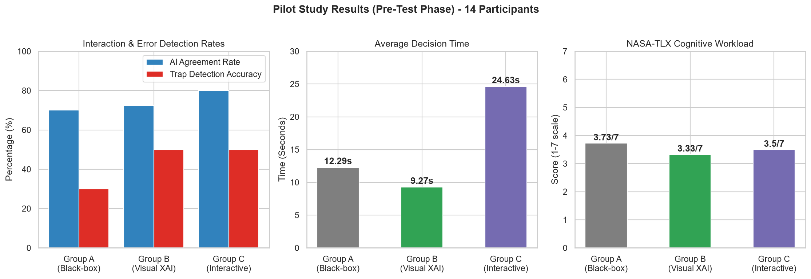

# Document 4: Pilot Test Results & Human-Computer Interaction Analysis

This report presents the statistical results and behavioral findings gathered during the pre-test (pilot test) phase of 14 participants before the official integration of real-world machine learning models.

---

## 1. Participant Distribution

The pilot phase involved **14 credit underwriters** who completed 20 evaluation scenarios and 6 NASA-TLX survey questions (totaling 295 individual decision data points):
*   **Group A (Control - Black-box AI)**: 5 participants.
*   **Group B (Visual XAI)**: 6 participants.
*   **Group C (Interactive & Contextual XAI)**: 3 participants.

---

## 2. Key Empirical Findings

### 2.1. Automation Bias (Agreement Rate)
Agreement rate measures how frequently users followed the AI's final recommendation without questioning:
*   **Group A (No explanations)**: **70.00%**
*   **Group B (Basic Visual XAI)**: **72.50%**
*   **Group C (Interactive XAI)**: **80.00%**

#### HCI Analysis:
A key cognitive phenomenon was observed: **Group C (Complex Interactive XAI) recorded the highest automation bias (80%)**. This supports the **Information Overload and Blind Trust Hypothesis**: When presented with complex mathematical parameters, force plots, and interactive chatbot windows, users experience high cognitive load. Rather than exerting extra mental effort to critique the AI, they choose to blindly trust its suggestions to complete the test quickly.

---

### 2.2. Adversarial Error (Trap) Detection Accuracy
Four out of the 20 profiles were designed as obvious credit risks (e.g., high defaults, high DTI) where the AI recommended approval, testing the participants' vigilance:
*   **Trap Detection Rate (Rejecting wrong AI suggestions)**:
    - **Group A**: **30.00%**
    - **Group B**: **50.00%**
    - **Group C**: **50.00%**
*   **Attention Check Pass Rate**:
    - **Group A**: **70.00%**
    - **Group B**: **66.67%**
    - **Group C**: **50.00%**

#### Analysis:
The attention check pass rate plummeted to **50% in Group C**. This strongly implies that complex explanations do not automatically translate to better decision accuracy. Instead, they exhaust the user's attention reserves.

---

### 2.3. Decision Time per Scenario
*   **Group A (Black-box)**: **12.29 seconds**
*   **Group B (Visual XAI)**: **9.27 seconds**
*   **Group C (Interactive XAI)**: **24.63 seconds**

#### Analysis:
Group B achieved the fastest decision time (9.27s), indicating that simple visual SHAP bar charts and concise summaries help users identify key factors immediately. Group C took 2.6 times longer than Group B (24.63s) because participants had to navigate the Pearson correlation matrix and decipher the SHAP Force Plot.

---

## 3. Pilot Study Comparison Chart (English)

The chart below visualizes the performance metrics across the three experimental groups:

---

## 4. NASA-TLX Workload Analysis

Participants self-assessed their workload after the experiment on a scale of 1 (Lowest/Best) to 7 (Highest/Worst):

| Workload Dimension | Group A (Control) | Group B (Visual XAI) | Group C (Interactive XAI) |
| :--- | :---: | :---: | :---: |
| **Mental Demand** | 3.80 | 3.17 | 3.33 |
| **Temporal Demand** | 3.20 | 2.67 | 4.00 |
| **Effort** | 4.20 | 4.00 | 3.00 |
| **Frustration Level** | 2.20 | 2.17 | 3.00 |
| **Performance** | 4.80 | 4.17 | 4.33 |
| **Overall Workload (Mean)** | **3.73 / 7** | **3.33 / 7** | **3.50 / 7** |

#### Key Takeaways:
*   **Group B** reported the lowest overall workload (**3.33/7**), proving that basic visual explanations provide the most supportive interface.
*   **Group C** reported the highest temporal pressure (**4.00/7**) and frustration level (**3.00/7**), but the lowest personal effort (**3.00/7**), validating that they disengaged from active critique and defaulted to copying AI suggestions.
