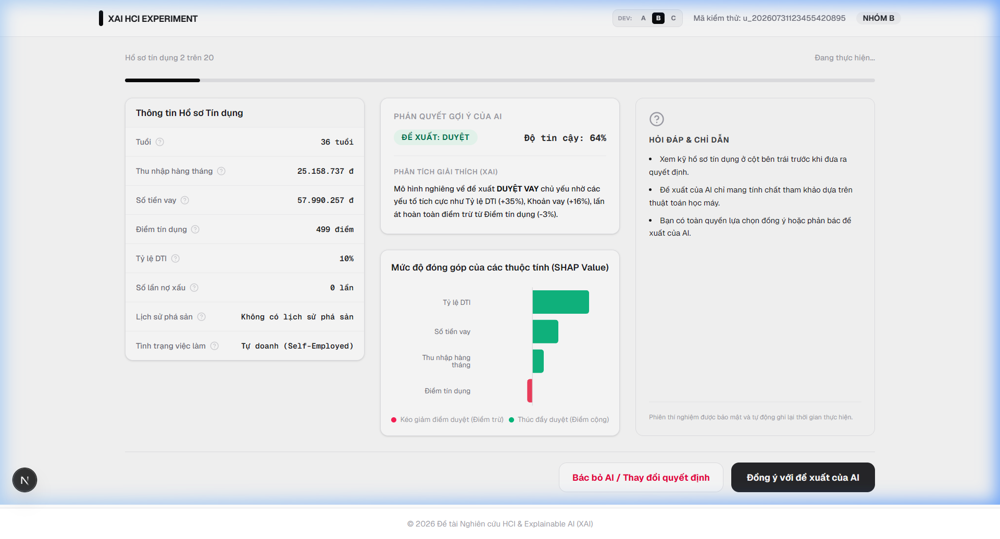
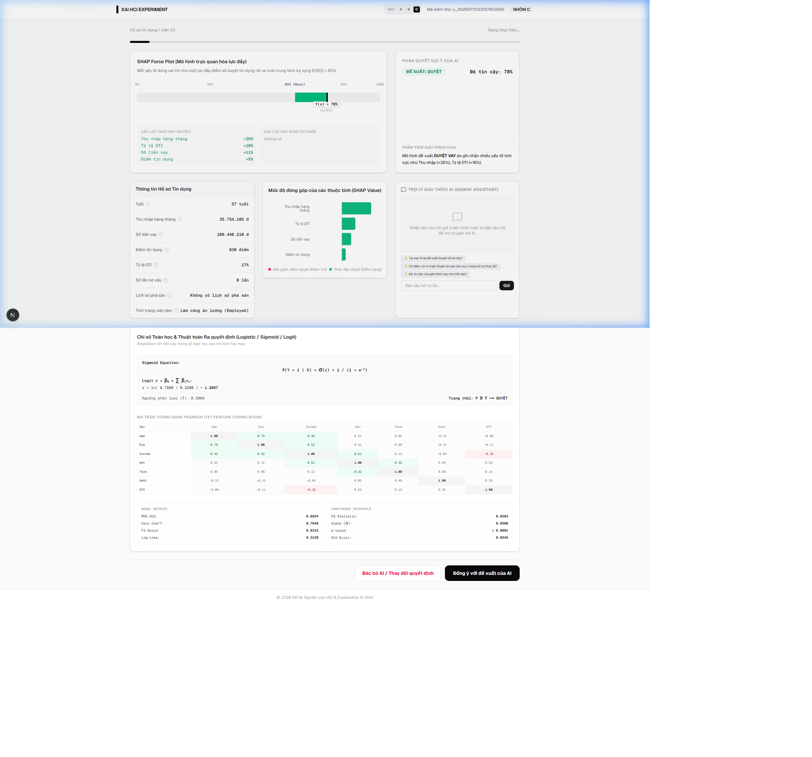
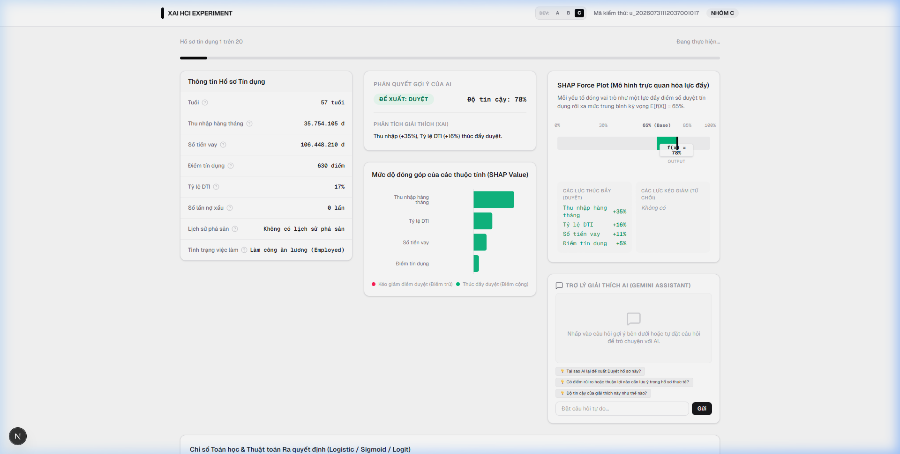

# Báo cáo 2: Tài Liệu Hướng Dẫn & Kiến Trúc Hệ Thống Web Thực Nghiệm HCI

Báo cáo này cung cấp thông tin chi tiết về kiến trúc phần mềm, cấu trúc cơ sở dữ liệu, các tính năng tương tác của ứng dụng web phục vụ thực nghiệm so sánh XAI và giao diện người dùng.

---

## 1. Công nghệ phát triển (Technology Stack)
Hệ thống được phát triển trên mô hình Full-stack hiện đại để đảm bảo khả năng đáp ứng thời gian thực và ghi nhận dữ liệu thực nghiệm chuẩn xác:
*   **Framework**: Next.js 16.2 (Sử dụng App Router và chế độ kết xuất hỗn hợp Server/Client Components).
*   **Ngôn ngữ**: TypeScript bảo đảm chặt chẽ cấu trúc dữ liệu.
*   **Giao diện & Styling**: Vanilla CSS kết hợp Tailwind CSS để tối ưu hóa khả năng hiển thị responsive và tạo hiệu ứng kính mờ (glassmorphism) sang trọng.
*   **Cơ sở dữ liệu (Database)**: PostgreSQL (lưu trữ cloud qua Supabase khi chạy production, đồng bộ hóa qua Prisma ORM). Khi chạy thử nghiệm cục bộ (development), hệ thống sử dụng một client mô phỏng ghi nhận dữ liệu trực tiếp vào tệp `data/local_db.json`.
*   **Trí tuệ nhân tạo tích hợp**: API Gemini Pro (Google Gemini API) dùng làm lõi chatbot đối thoại giải thích tự nhiên.

---

## 2. Các phân hệ tính năng và thiết kế giao diện (UI/UX)

### 2.1. Phân hệ đăng nhập thông tin và Hướng dẫn đọc giao diện (Onboarding)
*   **Chức năng**: Người dùng nhập Họ tên và Mã số sinh viên trước khi kiểm thử. Hệ thống sẽ tự động bốc ngẫu nhiên người dùng vào một trong 3 nhóm (A, B, C).
*   **Onboarding Timer**: Bộ đếm thời gian chạy ngầm để ghi nhận chính xác thời gian (giây) người dùng dành ra để đọc tài liệu hướng dẫn cấu trúc giao diện trước khi nhấn "Bắt đầu thực nghiệm".

### 2.2. Giao diện Nhóm A (Black-box AI - Nhóm Đối chứng)
Bố cục giao diện Nhóm A cực kỳ tối giản để làm mốc đối chứng (control group):
*   **Cột bên trái**: Bảng hồ sơ khách hàng hiển thị rõ nét 8 thuộc tính thông số tài chính.
*   **Cột bên phải**: Chỉ hiển thị duy nhất thẻ phán quyết gợi ý của AI (DUYỆT hoặc TỪ CHỐI) kèm theo độ tin cậy của thuật toán học máy, hoàn toàn không có bất kỳ biểu đồ giải thích (XAI) hay văn bản biện hộ nào.

---

### 2.3. Giao diện Nhóm B (Visual XAI - Trực quan hóa cơ bản)
Bố cục giao diện Nhóm B sử dụng thiết kế 2 cột truyền thống:
*   **Cột bên trái**: Bảng hồ sơ khách hàng hiển thị rõ nét 8 thuộc tính.
*   **Cột bên phải**: Thẻ kết luận đề xuất của AI in đậm nổi bật kết hợp biểu đồ cột Recharts co dãn động. Đoạn văn XAI giải thích tự nhiên mạch lạc mô tả tóm tắt nguyên nhân.

---

### 2.4. Giao diện Nhóm C (Advanced Dashboard Layout)
Để tối đa hóa sự tương phản và thử nghiệm mức độ quá tải nhận thức, giao diện Nhóm C được thiết kế lại hoàn toàn dưới dạng Dashboard phân tích 3 hàng:
*   **Hàng 1**: Đặt biểu đồ ngang **SHAP Force Plot** chiếm 2/3 bề rộng màn hình làm tiêu điểm, bên cạnh là thẻ gợi ý của AI.
*   **Hàng 2**: Xếp song song 3 cột (ProfileTable - SHAP Bar Chart - AI Chatbot Assistant) side-by-side.
*   **Hàng 3**: Trình bày ma trận tương quan Pearson 7x7 và các chỉ số mô hình dành cho kiểm định chuyên gia.

---

### 2.5. Tính năng Chú giải Nghiệp vụ (Domain Tooltips)
Tính năng hỗ trợ người dùng tự tra cứu kiến thức nghiệp vụ tài chính ngân hàng. Khi di chuột vào biểu tượng câu hỏi nhỏ bên cạnh mỗi thuộc tính, bong bóng chú giải sẽ xuất hiện tức thì:
*   *Ví dụ*: Hover vào trường **Điểm tín dụng** hiển thị: *"Điểm FICO đánh giá độ uy tín tín dụng: Dưới 580 (Rất yếu), 580-669 (Trung bình), 670-739 (Tốt), trên 740 (Rất tốt)."*
*   *Ví dụ*: Hover vào **Lịch sử nợ xấu** hiển thị: *"Số lần khách hàng quá hạn trả nợ trên 90 ngày (Nợ nhóm 3-5). Đây là cảnh báo rủi ro cực kỳ nghiêm trọng trong quy chế cấp tín dụng ngân hàng."*

---

### 2.6. Trợ lý Giải thích Conversational AI (Gemini Chatbot)
Tích hợp trực tiếp tại giao diện Nhóm C:
*   Người dùng có thể hỏi tự do về hồ sơ (ví dụ: *"Tại sao khách hàng này lương 50 triệu nhưng vẫn bị từ chối?"*).
*   Cung cấp các nút câu hỏi gợi ý nhanh sinh động theo ngữ cảnh của từng hồ sơ.
*   Cơ chế **Fallback Pattern-Matching**: Nếu không thiết lập API Key hoặc mất mạng, hệ thống tự động quét từ khóa tin nhắn của người dùng đối chiếu với bộ dữ liệu Q&A sinh sẵn từ trước của kịch bản để phản hồi chính xác, đảm bảo trải nghiệm không bao giờ bị gián đoạn.

---

## 3. Phân hệ ghi nhận hành vi HCI (Interaction Logger)
Hệ thống tích hợp một logger lắng nghe sự kiện ở Frontend và đồng bộ về API `/api/responses`:
*   `hover_details`: Theo dõi chi tiết đối tượng hover chuột (ví dụ: người dùng hover vào biểu đồ SHAP 5 lần, xem ma trận tương quan 2 lần). Lưu trữ dạng JSON: `{"ShapBarChart": 5, "MathMatrixView": 2}`.
*   `chat_history`: Ghi lại chi tiết nội dung cuộc hội thoại giữa người thẩm định và AI.
*   `interactive_clicks`: Ghi nhận số lượt click chuột tương tác trên các nút bấm nghiệp vụ.

## 4. Trang quản trị xuất dữ liệu thực nghiệm (Admin Panel)
Truy cập tại `/admin/export`:
*   Hiển thị danh sách toàn bộ các lượt sinh viên tham gia thực nghiệm.
*   Hỗ trợ tải xuống tệp dữ liệu CSV chuẩn hóa chứa đầy đủ các cột đo lường hành vi (`time_spent_seconds`, `hover_count`, `hover_details`, `chat_count`, `chat_history`, `is_correct_on_error_case`) phục vụ cho việc nhập liệu vào phần mềm phân tích thống kê (SPSS/R) của khóa luận.

---

### Ghi nhận Đóng góp & Tuyên bố về Vai trò của AI (AI Attribution Statement)
*   **Hỗ trợ kỹ thuật & Biên soạn**: Tài liệu này được biên soạn, thiết kế bảng phân tích thống kê và cấu trúc hóa ngôn ngữ với sự trợ giúp của trợ lý lập trình trí tuệ nhân tạo **Antigravity (Google DeepMind)**. 
*   **Trách nhiệm khoa học & Ý tưởng chủ đạo**: Toàn bộ thiết kế thực nghiệm, định hướng nghiên cứu, thu thập dữ liệu thực tế, các phát hiện định tính về giao diện (bao gồm các quan sát về sự mơ hồ trong tương tác giao diện) và việc chịu trách nhiệm khoa học/bảo vệ kết quả nghiên cứu hoàn toàn thuộc về tác giả khóa luận (con người).

