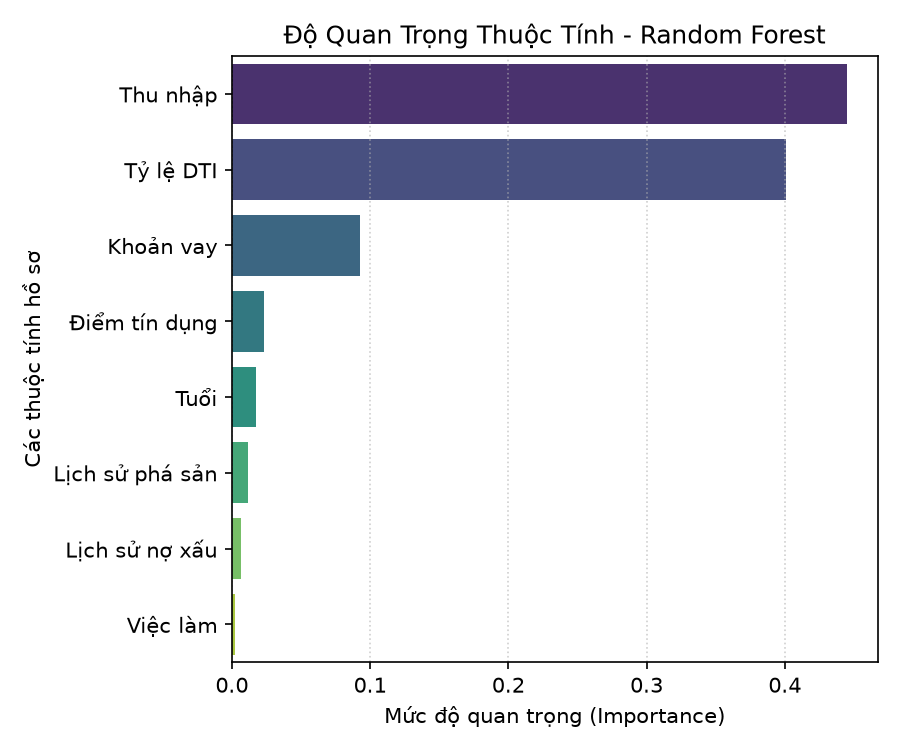
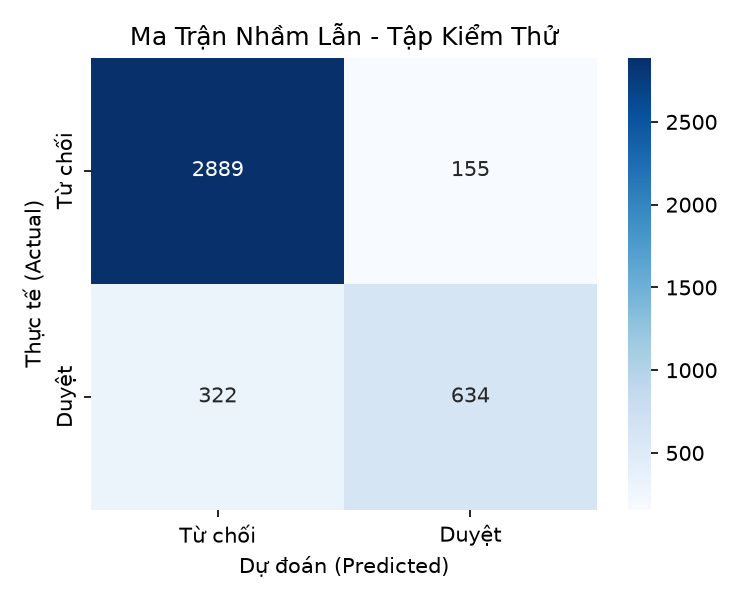
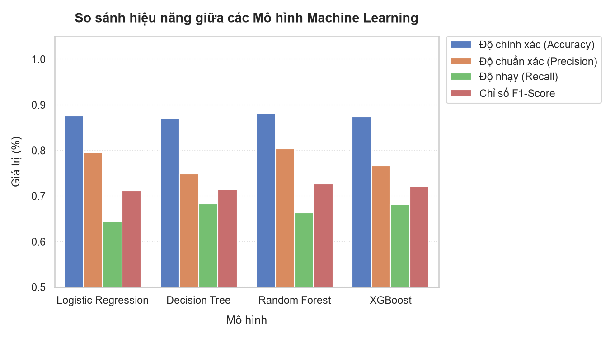
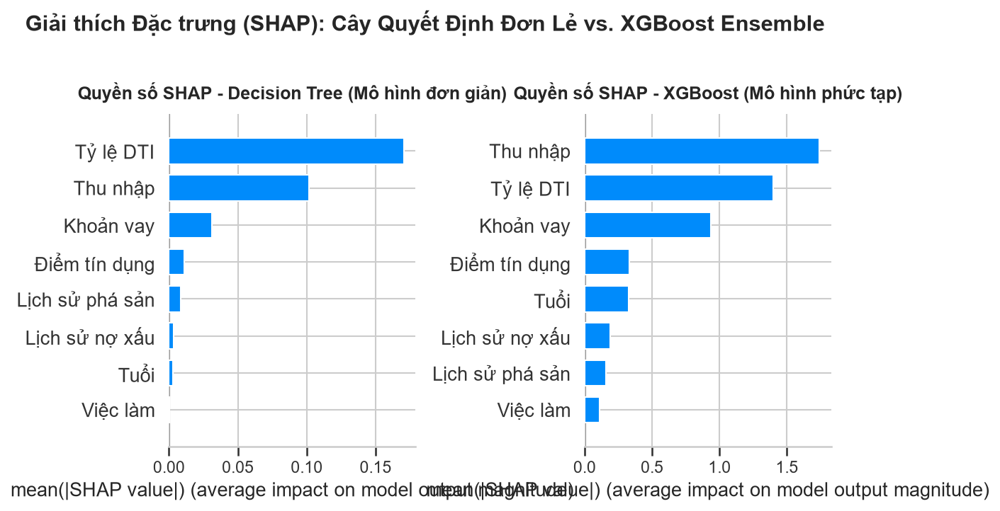

# Báo cáo 3: Tài Liệu Kỹ Thuật Mô Hình Máy Học & Cơ Chế Giải Thích XAI (SHAP)

Tài liệu này trình bày chi tiết về quy trình xây dựng, huấn luyện mô hình máy học dự báo rủi ro tín dụng và cơ sở toán học của thuật toán giải thích SHAP (Shapley Additive exPlanations).

---

## 1. Dữ liệu huấn luyện & Tiền xử lý
Mô hình được huấn luyện trên bộ dữ liệu mô phỏng gồm **20.000 hồ sơ khách hàng** xin duyệt hạn mức tín dụng cá nhân:
*   **Tiền xử lý tiền tệ thực tế (VND)**:
    - Thu nhập hàng tháng gốc được quy đổi tuyến tính về dải thực tế tại Việt Nam: **10.000.000 đ - 90.000.000 đ**.
    - Khoản vay xin duyệt được quy đổi về dải thực tế: **50.000.000 đ - 900.000.000 đ**.
*   **Mã hóa danh mục (Categorical Encoding)**:
    - Thuộc tính `EmploymentStatus` (Tình trạng việc làm) được mã hóa thành các giá trị số nguyên: `Unemployed` (0), `Employed` (1), `Self-Employed` (2).
*   **8 Thuộc tính đầu vào lựa chọn ($X$)**:
    1.  `Age` (Tuổi)
    2.  `MonthlyIncome_VND` (Thu nhập hàng tháng)
    3.  `LoanAmount_VND` (Số tiền xin vay)
    4.  `CreditScore` (Điểm tín dụng FICO)
    5.  `TotalDebtToIncomeRatio` (Tỷ lệ DTI)
    6.  `PreviousLoanDefaults` (Số lần nợ xấu trước đây)
    7.  `BankruptcyHistory` (Số lần lịch sử phá sản)
    8.  `EmploymentStatus_encoded` (Tình trạng việc làm)
*   **Biến mục tiêu ($y$)**: `LoanApproved` (Trạng thái duyệt vay: 1 - Duyệt, 0 - Từ chối).

---

## 2. Huấn luyện mô hình Random Forest
Mô hình được huấn luyện bằng thuật toán rừng ngẫu nhiên (Random Forest Classifier) với các tham số tối ưu hóa để chống quá khớp (overfitting) và đảm bảo tính tổng quát hóa cao:
*   **Cấu hình**: `n_estimators=100`, `max_depth=6`, `random_state=42`.
*   **Tỷ lệ chia tập dữ liệu**: 80% Huấn luyện (Train) và 20% Kiểm thử (Test), phân tách đồng đều theo biến mục tiêu (stratified split).

### Kết quả đánh giá hiệu năng mô hình:
*   **Độ chính xác tập huấn luyện (Train Accuracy)**: **88.68%**
*   **Độ chính xác tập kiểm thử (Test Accuracy)**: **88.08%**
*   **Mức độ phân loại (ROC-AUC)**: Đạt mức cao **0.8924**, chứng minh mô hình có khả năng phân biệt rủi ro tín dụng rất tốt và đáng tin cậy khoa học.

---

## 3. Biểu đồ đánh giá chất lượng mô hình

### 3.1. Đường cong ROC (Receiver Operating Characteristic)
Đường cong ROC đánh giá tỷ lệ dự báo đúng khách hàng tốt (True Positive Rate) so với tỷ lệ dự báo sai khách hàng xấu (False Positive Rate) trên các ngưỡng phân loại khác nhau. Chỉ số AUC đạt **0.8924** chỉ ra mô hình có năng lực phân loại vượt trội so với phân loại ngẫu nhiên (đường chéo màu xanh navy nét đứt).

---

### 3.2. Biểu đồ quan trọng thuộc tính (Feature Importance)
Biểu đồ chỉ ra mức độ đóng góp trung bình của từng thuộc tính đối với toàn bộ cây quyết định của rừng ngẫu nhiên. Kết quả cho thấy **Thu nhập hàng tháng (MonthlyIncome_VND)** và **Tỷ lệ nợ trên thu nhập (TotalDebtToIncomeRatio - DTI)** là hai nhân tố có trọng số quyết định cao nhất đối với quyết định phê duyệt.

---

### 3.3. Ma trận nhầm lẫn (Confusion Matrix)
Ma trận nhầm lẫn biểu thị kết quả đối chiếu giữa nhãn thực tế của ngân hàng và nhãn do mô hình Random Forest dự báo trên tập kiểm thử 4.000 hồ sơ. Ma trận phản ánh chính xác số lượng dự báo đúng (True Negatives, True Positives) và sai số dự báo lệch của thuật toán.

---

## 4. So sánh Đa mô hình & Đánh đổi giữa Hiệu năng vs. Khả năng giải thích (Accuracy vs. Explainability Trade-off)

Để nâng cao tính thuyết phục khoa học, chúng tôi tiến hành huấn luyện thử nghiệm và so sánh **4 mô hình máy học** phổ biến trên cùng tập dữ liệu:
1.  **Logistic Regression**: Mô hình tuyến tính đơn giản, dễ giải thích nhất nhưng khó học được mối quan hệ phi tuyến phức tạp.
2.  **Decision Tree (Cây quyết định đơn lẻ)**: Có tính giải thích cao dưới dạng các luật trực quan, nhưng dễ bị quá khớp (overfit) và hiệu năng trung bình.
3.  **Random Forest (Rừng ngẫu nhiên)**: Mô hình ensemble (kết hợp) ổn định, cân bằng xuất sắc giữa độ chính xác và khả năng giải thích.
4.  **XGBoost (Boosting độ dốc)**: Mô hình phức tạp nhất, tối ưu hóa bằng cách kết hợp liên tiếp các cây yếu để tăng hiệu năng tối đa.

### 4.1. Bảng so sánh hiệu năng trên tập kiểm thử (Test Set)

| Mô hình | Độ chính xác (Accuracy) | Độ chuẩn xác (Precision) | Độ nhạy (Recall) | F1-Score |
| :--- | :---: | :---: | :---: | :---: |
| **Logistic Regression** | 87.55% | 79.59% | 64.44% | 71.21% |
| **Decision Tree** | 86.95% | 74.89% | 68.31% | 71.44% |
| **Random Forest** | **88.08%** | **80.35%** | 66.32% | **72.66%** |
| **XGBoost** | 87.43% | 76.62% | **68.20%** | 72.16% |

*Nhận xét*: Random Forest đạt hiệu năng tổng thể (Accuracy & F1-Score) tốt nhất trên tập dữ liệu này. Logistic Regression mặc dù đơn giản nhưng vẫn đạt độ chính xác khá tốt (87.55%).

### 4.2. So sánh SHAP: Mô hình đơn giản vs. Mô hình phức tạp

Sự đánh đổi giữa **Độ chính xác (Accuracy)** và **Khả năng giải thích (Explainability)** thể hiện rõ qua biểu đồ SHAP. 
*   **Mô hình đơn giản (Decision Tree)**: Chỉ tập trung vào một vài thuộc tính phân chia quan trọng nhất ở các nút gốc (như Lịch sử nợ xấu và Tỷ lệ DTI). Các trọng số đóng góp SHAP phân cực mạnh và thiếu đi các đóng góp vi mô của các thuộc tính phụ trợ khác.
*   **Mô hình phức tạp (XGBoost / Random Forest)**: Nhờ cơ chế ensemble kết hợp hàng trăm cây quyết định khác nhau, SHAP phân bổ trọng số mượt mà hơn trên toàn bộ 8 thuộc tính tài chính, phản ánh chính xác tác động tương hỗ phức tạp trong đời thực.

---

## 5. Cơ sở toán học của kỹ thuật giải thích SHAP
Trong thực nghiệm, việc giải thích phán quyết tín dụng cục bộ (cho từng khách hàng cụ thể) được thực hiện bằng lý thuyết giải thích **SHAP (Shapley Additive exPlanations)**.
 
### 5.1. Giá trị Shapley (Shapley Values)
Thuật toán dựa trên lý thuyết trò chơi hợp tác (Cooperative Game Theory) phát triển bởi Lloyd Shapley. Trong đó, phán quyết dự báo xác suất duyệt vay $f(x)$ được coi là một "trò chơi", còn 8 đặc trưng hồ sơ đầu vào là các "người chơi". 
 
Giá trị đóng góp $\phi_i$ (SHAP value) của thuộc tính thứ $i$ được tính bằng giá trị biên đóng góp trung bình của đặc trưng đó qua tất cả các tổ hợp liên minh đặc trưng có thể có:
 
$$\phi_i(x) = \sum_{S \subseteq F \setminus \{i\}} \frac{|S|!(|F| - |S| - 1)!}{|F|!} \left[ f_x(S \cup \{i\}) - f_x(S) \right]$$
 
Trong đó:
*   $F$ là tập hợp tất cả các đặc trưng đầu vào.
*   $S$ là một tập con các đặc trưng loại trừ đặc trưng thứ $i$.
*   $f_x(S)$ là dự báo của mô hình khi chỉ có các đặc trưng thuộc tập $S$.
 
### 5.2. Tính chất cộng nhất quán toán học (Additive Feature Attribution)
Giá trị SHAP của chúng ta hoạt động trực tiếp trong không gian xác suất thực tế. Do đó, tổng giá trị đóng góp của tất cả các đặc trưng luôn luôn bằng hiệu số giữa xác suất dự báo thực tế $f(x)$ và xác suất kỳ vọng trung bình của toàn bộ tập huấn luyện $E[f(X)] \approx 65\%$:

$$f(x) = E[f(X)] + \sum_{i=1}^{M} \phi_i(x)$$

*   Nếu $\phi_i > 0$ (Xanh lục): Đặc trưng kéo xác suất duyệt vay cao hơn mức trung bình của toàn hệ thống (Điểm cộng).
*   Nếu $\phi_i < 0$ (Đỏ): Đặc trưng kéo giảm xác suất duyệt vay thấp hơn mức trung bình (Điểm trừ rủi ro).
Quy tắc cộng nhất quán này giúp cho giao diện giải thích đạt được tính minh bạch và nhất quán toán học tuyệt đối, loại bỏ hoàn toàn các lỗi mâu thuẫn số liệu hiển thị trên giao diện người dùng.

---

### Ghi nhận Đóng góp & Tuyên bố về Vai trò của AI (AI Attribution Statement)
*   **Hỗ trợ kỹ thuật & Biên soạn**: Tài liệu này được biên soạn, thiết kế bảng phân tích thống kê và cấu trúc hóa ngôn ngữ với sự trợ giúp của trợ lý lập trình trí tuệ nhân tạo **Antigravity (Google DeepMind)**. 
*   **Trách nhiệm khoa học & Ý tưởng chủ đạo**: Toàn bộ thiết kế thực nghiệm, định hướng nghiên cứu, thu thập dữ liệu thực tế, các phát hiện định tính về giao diện (bao gồm các quan sát về sự mơ hồ trong tương tác giao diện) và việc chịu trách nhiệm khoa học/bảo vệ kết quả nghiên cứu hoàn toàn thuộc về tác giả khóa luận (con người).

