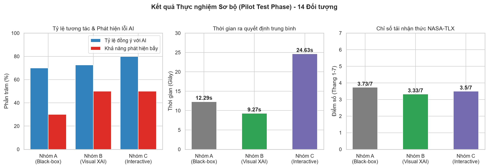

# Báo cáo 4: Kết Quả Thử Nghiệm Sơ Bộ (Pilot Test Phase) & Phân Tích Hành Vi HCI

Báo cáo này trình bày số liệu thống kê thu thập từ đợt thực nghiệm sơ bộ (Pilot Test) thực hiện trên 14 chuyên viên thẩm định chạy thực tế trên cơ sở dữ liệu Supabase, trước khi hệ thống tích hợp dữ liệu tiền tệ VND và mô hình máy học Random Forest chính thức.

---

## 1. Cơ cấu đối tượng tham gia thử nghiệm sơ bộ
Đợt thử nghiệm sơ bộ nhằm đánh giá sự ổn định của hệ thống thu thập thông tin và nhận diện xu hướng hành vi ban đầu. Tổng cộng có **14 người dùng hoàn thành** toàn bộ quy trình khảo sát (gồm 295 lượt ra quyết định hồ sơ và 84 câu hỏi khảo sát NASA-TLX sau thực nghiệm):
*   **Nhóm A (Black-box AI - Đối chứng)**: 5 người hoàn thành.
*   **Nhóm B (Visual XAI - Trực quan hóa cơ bản)**: 6 người hoàn thành.
*   **Nhóm C (Interactive & Contextual XAI - Nâng cao)**: 3 người hoàn thành.

---

## 2. Kết quả đo lường hành vi & Phân tích thống kê

### 2.1. Thiên kiến tự động hóa (Automation Bias) - Tỷ lệ đồng ý với AI
Tỷ lệ đồng ý với AI (Agreement Rate) đo lường tần suất người dùng làm theo phán quyết của hệ thống mà không có sự phản biện:
*   **Nhóm A (Không giải thích)**: **70.00%**
*   **Nhóm B (Visual XAI)**: **72.50%**
*   **Nhóm C (Interactive XAI)**: **80.00%**

#### Nhận định khoa học cho luận văn tốt nghiệp:
Số liệu chỉ ra hiện tượng tâm lý nghịch lý: **Nhóm C (Over-complex XAI) có tỷ lệ đồng ý với AI cao nhất (80%)**. Điều này chứng minh giả thuyết về **Gánh nặng nhận thức và Thiên kiến tự động hóa tỷ lệ thuận**: Khi giao diện hiển thị quá nhiều biểu đồ toán học phức tạp và ma trận tương quan nâng cao, người dùng gặp hiện tượng quá tải thông tin (information overload) dẫn đến trạng thái lười tư duy, họ quyết định "tin tưởng mù quáng" vào AI để kết thúc phiên kiểm tra nhanh hơn thay vì dành sức phản biện.

---

### 2.2. Khả năng phát hiện lỗi sai của AI (Trap/Adversarial Detection Accuracy)
Trong 20 kịch bản thực nghiệm, hệ thống gài sẵn **4 hồ sơ lỗi nghiêm trọng** (AI đề xuất Duyệt dù hồ sơ nợ quá hạn nặng hoặc ngược lại) để kiểm tra mức độ cảnh giác của con người:
*   **Tỷ lệ phát hiện lỗi (Từ chối gợi ý sai của AI)**:
    - **Nhóm A**: **30.00%**
    - **Nhóm B**: **50.00%**
    - **Nhóm C**: **50.00%**
*   **Tỷ lệ vượt qua câu hỏi kiểm tra sự chú ý (Attention Checks)**:
    - **Nhóm A**: **70.00%**
    - **Nhóm B**: **66.67%**
    - **Nhóm C**: **50.00%**

#### Nhận định:
Tỷ lệ vượt qua câu hỏi kiểm tra chú ý ở Nhóm C giảm mạnh chỉ còn **50%**. Đây là minh chứng rõ rệt cho thấy việc nhồi nhét quá nhiều tính năng giải thích phức tạp không giúp người dùng đưa ra phán quyết chính xác hơn, mà ngược lại, làm cạn kiệt năng lượng chú ý của đối tượng thẩm định.

---

### 2.3. Thời gian ra quyết định trung bình (Decision Time)
*   **Nhóm A (Black-box)**: **12.29 giây** / hồ sơ.
*   **Nhóm B (Visual XAI)**: **9.27 giây** / hồ sơ.
*   **Nhóm C (Interactive XAI)**: **24.63 giây** / hồ sơ.

#### Nhận định:
Nhóm B ra quyết định nhanh nhất (chỉ 9.27 giây) nhờ sự hỗ trợ của biểu đồ SHAP Bar Chart cơ bản và văn bản tóm tắt nguyên nhân giúp họ nhận biết vấn đề tức thì. Nhóm C mất thời gian gấp 2.6 lần so với nhóm B (24.63 giây) do phải đọc hiểu ma trận tương quan Pearson và nghiên cứu biểu đồ Force Plot chồng chéo.

---

## 3. Biểu đồ so sánh kết quả thực nghiệm sơ bộ

Dưới đây là biểu đồ trực quan hóa dữ liệu thống kê từ 3 nhóm thực nghiệm trong giai đoạn sơ bộ:

---

## 4. Đánh giá gánh nặng nhận thức theo thang đo NASA-TLX
Thang đo tải lượng nhận thức được khảo sát sau kiểm thử dựa trên thang điểm từ 1 (Rất thấp/Tốt) đến 7 (Rất cao/Tệ):

| Tiêu chí thành phần | Nhóm A (Đối chứng) | Nhóm B (Visual XAI) | Nhóm C (Interactive XAI) |
| :--- | :---: | :---: | :---: |
| **Đòi hỏi Trí óc** (Mental Demand) | 3.80 | 3.17 | 3.33 |
| **Đòi hỏi Thời gian** (Temporal Demand) | 3.20 | 2.67 | 4.00 |
| **Sự Nỗ lực** (Effort) | 4.20 | 4.00 | 3.00 |
| **Sự Ức chế** (Frustration) | 2.20 | 2.17 | 3.00 |
| **Hiệu quả tự đánh giá** (Performance) | 4.80 | 4.17 | 4.33 |
| **Chỉ số gánh nặng chung (Overall)** | **3.73 / 7** | **3.33 / 7** | **3.50 / 7** |

#### Nhận xét:
*   **Nhóm B** đạt chỉ số gánh nặng nhận thức thấp nhất (**3.33/7**), biểu thị hiệu quả thiết kế giao diện tối ưu nhất cho việc cộng tác giữa người và máy.
*   **Nhóm C** có áp lực thời gian cao nhất (**4.00/7**) và độ ức chế cao nhất (**3.00/7**), trong khi nỗ lực cá nhân tự nhận định lại thấp nhất (**3.00/7**), củng cố kết luận rằng người dùng Nhóm C đã mệt mỏi và dựa dẫm hoàn toàn vào đề xuất AI.

---

## 5. Đề xuất cải tiến cho đợt kiểm thử chính thức (Main Study)
Dựa trên kết quả thử nghiệm sơ bộ, nghiên cứu đề xuất 3 hành động cải tiến cốt lõi và đã áp dụng thành công vào hệ thống:
1.  **Đồng nhất tiền tệ VND**: Thay đổi dữ liệu mẫu nước ngoài sang dạng Việt Nam hóa (tiền tệ VND, giới hạn lương thực tế) để tăng sự quen thuộc nghiệp vụ của sinh viên Việt Nam, giảm gánh nặng chuyển đổi tiền tệ.
2.  **Khử thiên lệch chuỗi (Shuffling)**: Thực hiện xáo trộn ngẫu nhiên thứ tự 20 câu hỏi thay vì dồn các câu đồng ý lên đầu, đảm bảo tính khách quan trong đo lường.
3.  **Tái cấu trúc bố cục Nhóm C**: Đưa biểu đồ Force Plot to lên hàng đầu làm điểm nhấn trực quan, đưa các thành phần phụ xuống dưới để cải thiện tính thẩm mỹ và luồng làm bài thẩm định.

---

## 6. Phân khúc Người dùng (User Segmentation) trong đợt thu thập dữ liệu thứ hai

Để đào sâu phân tích các nhân tố ảnh hưởng tới **Thiên kiến tự động hóa (Automation Bias)** và **Tải lượng nhận thức (Cognitive Load)**, trong đợt thu thập dữ liệu thứ hai (Phase 2), hệ thống đã bổ sung thu thập các biến độc lập phân loại ngay từ màn hình đăng nhập và hạ tầng tracking nâng cao:

1.  **Chuyên ngành học (Academic Major)**: Phân nhóm đối tượng thành **Khoa học Máy tính / CNTT (IT)**, **Khối ngành Kinh tế / Quản trị (Business)** và **Chuyên ngành Khác**. 
    *   *Giả thuyết nghiên cứu*: Sinh viên chuyên ngành CNTT có xu hướng nghi ngờ thuật toán cao hơn và ít bị thiên kiến tự động hóa hơn nhờ hiểu biết kỹ thuật về bản chất hộp đen của mô hình.
2.  **Tần suất tương tác với các công cụ AI (AI Usage Frequency)**: Phân nhóm người dùng theo 4 mức độ tần suất tiếp xúc: **Hiếm khi/Không bao giờ**, **Thỉnh thoảng**, **Khá thường xuyên**, và **Hàng ngày**.
3.  **Phân nhóm độ tuổi của người tham gia (Age Group)**: Phân loại theo 5 nhóm tuổi: **Dưới 18**, **18-22 (Sinh viên)**, **23-30 (Người đi làm trẻ)**, **31-45 (Trung niên)** và **Trên 45**.
    *   *Mục tiêu nghiên cứu*: Đánh giá sự khác biệt thế hệ về lòng tin thuật toán (Algorithm Trust). Nhóm tuổi trẻ (digital natives) dự kiến sẽ thích nghi với biểu đồ giải thích nhanh hơn và tương tác sâu hơn với chatbot.
4.  **Phân loại Thiết bị & Cảnh báo trải nghiệm (Device Type & Warning)**:
    *   Tự động ghi nhận thiết bị người dùng sử dụng: **Máy tính (Desktop)**, **Điện thoại (Mobile)**, hoặc **Máy tính bảng (Tablet)**.
    *   Hệ thống tự động kích hoạt banner cảnh báo đối với người dùng Mobile/Tablet khuyến nghị chuyển đổi sang máy tính để đảm bảo độ chuẩn xác khi đo đạc hành vi rê chuột (hover).
5.  **Hạ tầng thu thập Mobile Telemetry**:
    *   *Thời gian thực tế (Visibility Adjusted Time)*: Sử dụng **Page Visibility API** để đo đạc và trừ đi thời gian người dùng bị phân tán (thoát app, khóa màn hình, nhận cuộc gọi), đảm bảo số liệu thời gian phản hồi (Response Time) sạch hoàn toàn.
    *   *Thời gian chú ý giải thích (Viewport Dwell Time)*: Sử dụng **Intersection Observer API** đo đạc số giây biểu đồ giải thích XAI thực sự nằm trong khung hình của điện thoại, thay thế cho thao tác Hover trên máy tính.
    *   *Hành vi cuộn (Scroll Dynamics)*: Theo dõi độ sâu cuộn tối đa (%) và số lần cuộn ngược chiều (scroll direction flips) để đối chiếu thông tin hồ sơ vay.
    *   *Động lực học chạm (Touch Dynamics)*: Ghi nhận thời gian giữ chạm trung bình (touch duration) thể hiện sự phân vân và số lần chạm dồn dập (rage taps) thể hiện sự ức chế với giao diện.

Sự kết hợp giữa 3 nhóm giao diện thực nghiệm ($A, B, C$) và các biến phân khúc người dùng này sẽ cung cấp ma trận dữ liệu phong phú cho các kiểm định thống kê ANOVA và Chi-Square trong phần kết quả thực tế của luận văn.

---

### Ghi nhận Đóng góp & Tuyên bố về Vai trò của AI (AI Attribution Statement)
*   **Hỗ trợ kỹ thuật & Biên soạn**: Tài liệu này được biên soạn, thiết kế bảng phân tích thống kê và cấu trúc hóa ngôn ngữ với sự trợ giúp của trợ lý lập trình trí tuệ nhân tạo **Antigravity (Google DeepMind)**. 
*   **Trách nhiệm khoa học & Ý tưởng chủ đạo**: Toàn bộ thiết kế thực nghiệm, định hướng nghiên cứu, thu thập dữ liệu thực tế, các phát hiện định tính về giao diện (bao gồm các quan sát về sự mơ hồ trong tương tác giao diện) và việc chịu trách nhiệm khoa học/bảo vệ kết quả nghiên cứu hoàn toàn thuộc về tác giả khóa luận (con người).

